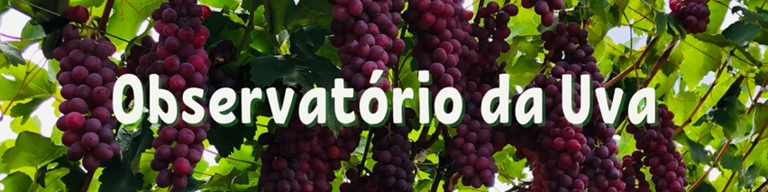

```{r setup, include=FALSE}
knitr::opts_chunk$set(
  echo       = FALSE,
  warning    = FALSE,
  message    = FALSE,
  comment    = NA,
  fig.width  = 10,
  fig.height = 6,
  fig.align  = "center",
  comment    = "#",
  size       = "normalsize"
  )

library(lubridate)
anterior <- as.Date("2022-01-01")
atual <-  as.Date("2022-02-01")
#today <- as.Date("2022-02-11")
today <- as.Date("2022-02-28")
```

<br>

# ANÁLISE DOS EMPREGOS GERADOS NA VITICULTURA EM `r toupper(strftime(anterior, format = "%B DE %Y"))`

<br>

Os dados utilizados nesta análise são mensais e disponibilizados pelo CAGED (Cadastro Geral de Empregados e Desempregados) para o mês de `r strftime(anterior, format = "%B de %Y")`. As variáveis são saldo de empregos, empregos por gênero, contratados por idade e por escolaridade para a cultura da uva. Considera-se o conjunto de municípios da Bahia (Casa Nova, Curaçá, Juazeiro, Sento Sé, Sobradinho, etc. ) e Pernambuco (Belém do S. Francisco, Lagoa Grande, Orocó, Petrolina, etc. ) que formam o Vale do Submédio São Francisco.

O saldo de empregos na viticultura em `r strftime(anterior, format = "%B de %Y")` no Vale do São Francisco é de 229 pessoas, ou seja, o total de contratações (2.070) foi maior do que o total de demissões (1.841). O saldo de empregos neste més foi menor do que em 2021 (475), uma redução de -51,79\%.

Dos contratados, 952 são do sexo masculino e 1.118 do sexo feminino. Em relação à idade, a grande maioria se concentra abaixo dos 30 anos: 308 até 21 anos, 306 com mais de 21 até 24 anos, 407 com mais de 24 até 30 anos. 

Em relação ao nivel de escolaridade, a maioria das admissões é de pessoas com ensino médio completo (739). Este grau de estudo junto com 6 ao 9 ano do ensino fundamental (415), fundamental completo (316) e médio incompleto (293) representam a grande parte dos contratados na viticultura no Vale do São Francisco em `r strftime(anterior, format = "%B de %Y")`. 

<br>

# 1. EVOLUÇÃO DO SALDO DE EMPREGOS GERADOS NA VITICULTURA

<br>

```{r tratamento_base}
#Direcionado o R para o Diretorio a ser trabalhado
setwd('c:/Users/Joao Ricardo Lima/Dropbox/tempecon/dados_caged')

#Inicio do Script
#Pacotes a serem utilizados 
library(ggplot2)
library(scales)
library(plotly)
library(magrittr)# pipe operations
library(tidyverse)
library(dplyr)

#Entrando dados no R
dados1 <- read.csv2('janeiro_2022.csv', header=T, sep=";", dec = ".")
colnames(dados1)[1] <- 'date'
dados1$date <- seq(as.Date('2021-01-01'),to=anterior,by='1 month')
dados1a <- dados1 
dados1a$ano <- strftime(dados1a$date, format="%Y") 
dados1a$mes <- strftime(dados1a$date, format="%b") 

saldo_21 <- dados1a %>% filter(ano=='2021')

saldo_21 <- saldo_21 %>%
  select(c(ano, mes, Saldo_uva))

saldo_22 <- dados1a %>% filter(ano=='2022')

saldo_22 <- saldo_22 %>%
  select(c(ano, mes, Saldo_uva))

saldom <- rbind(saldo_21, saldo_22)
saldom$mes <- factor(saldom$mes,levels = c("jan", "fev", "mar", "abr", "mai", 
                                           "jun", "jul", "ago", "set", "out",
                                           "nov", "dez"))

#Entrando com o restante dos dados

load("janeiro_22_caged.RData")

#dados_01_vsf$sexo <- lapply(dados_01_vsf$sexo, factor)

dados_01_vsf$sexo[dados_01_vsf$sexo == 1] <- 0
dados_01_vsf$sexo[dados_01_vsf$sexo == 3] <- 1

dados_01_vsf <- mutate(dados_01_vsf,
                sexo = factor(sexo, levels = 0:1, labels = c("Masculino", "Feminino")))

# Mantendo apenas 

#Separando as admissoes e as demissoes
dados_01_vsf_positivos <-dados_01_vsf%>% filter(saldo_movim=="1")
dados_01_vsf_negativos <-dados_01_vsf%>% filter(saldo_movim=="-1")

#Mantendo apenas o agronegocio
secao_positivos <-dados_01_vsf_positivos%>% filter(secao=="A")
secao_negativos <-dados_01_vsf_negativos%>% filter(secao=="A")

#Mantendo apenas a uva
subclasse_positivos <-dados_01_vsf_positivos%>% filter(subclasse=="132600")
subclasse_negativos <-dados_01_vsf_negativos%>% filter(subclasse=="132600")

subclasse_positivos <- mutate(subclasse_positivos,
                grau_instrucao = factor(grau_instrucao, levels = 1:13, 
                                        labels = c("Analfabeto",
                                                   "Até 5ª Incompleto",
                                                   "5ª Completo Fundamental",
                                                   "6ª a 9ª Fundamental",
                                                   "Fundamental Completo",
                                                   "Médio Incompleto",
                                                   "Médio Completo",
                                                   "Superior Incompleto",
                                                   "Superior Completo",
                                                   "Mestrado",
                                                   "Doutorado",
                                                   "Pós-Graduação completa",
                                                   "Não Identificado")))

```

```{r emp1}
#Gráfico com Ggplot2

mycolor1 <- "gold"
mycolors2 <- c("orange", "lightblue3")

g1 <- ggplot() +  #estetica vai valer para todos os geom's
  geom_col(data=saldom, aes(x=mes, y=Saldo_uva, fill=ano), size=2, width = 0.9, position = "dodge")+
    scale_fill_manual(values=mycolors2)+
    labs(y= "Saldo de Emprego (unidade)", x= "Meses do Ano", title='',
       caption = "")+
    scale_y_continuous(limits=c(-2600, 2200), n.breaks = 10, expand = expansion(add=c(0,0.5)))+
  theme_minimal()+ #Definindo tema
  theme(axis.text.x=element_text(angle=0, hjust=0.5, size=10, margin = margin(b=20)),
        axis.text.y=element_text(hjust=1, size=10, margin = margin(l=20)),
        axis.title.x = element_text(size=10, face = "bold", margin = margin(b=20)),
        axis.title.y = element_text(size=10, face = "bold", margin = margin(l=20)),
        panel.grid.major = element_blank(),
        panel.grid.minor = element_blank(),
        plot.title = element_text(hjust = 0.5, size=12),
        plot.caption = element_text(hjust = 0, size=12),
        legend.position = "bottom", legend.title = element_blank(),
        legend.text=element_text(size=12)) # Definindo posição da legenda

ggplotly(g1) %>%
  layout(legend = list(
                      orientation = "h", 
                      x=0.45, 
                      y=-0.25,
                      title=''))
```

<br>

# 2. DISTRIBUIÇÃO DOS EMPREGOS GERADOS POR GÊNERO

<br>


``` {r emp2}
### Histograma (Orçamentos de produção)

### Histograma

g2 <- ggplot(data = subclasse_positivos, aes(x = sexo, y = ..count..)) +
  geom_bar(fill='steelblue')+
    labs(y= "Contratados Uva - VSF", x= "Gênero", title='',
       caption = "")+
  theme_minimal()+ #Definindo tema
  theme(axis.text.x=element_text(angle=0, hjust=0.5, size=10, margin = margin(b=20)),
        axis.text.y=element_text(hjust=1, size=10, margin = margin(l=20)),
        axis.title.x = element_text(size=10, face = "bold", margin = margin(b=20)),
        axis.title.y = element_text(size=10, face = "bold", margin = margin(l=20)),
        panel.grid.major = element_blank(),
        panel.grid.minor = element_blank(),
        plot.title = element_text(hjust = 0.5, size=12),
        plot.caption = element_text(hjust = 0, size=12),
        legend.position = "bottom", legend.title = element_blank(),
        legend.text=element_text(size=12)) # Definindo posição da legenda

ggplotly(g2)
```

<br>

# 3. DISTRIBUIÇÃO DOS EMPREGOS GERADOS POR IDADE

<br>

``` {r emp3}
### Histograma (Orçamentos de produção)
g3 <- ggplot(data=subclasse_positivos, aes(x=idade))+
  geom_histogram(binwidth=3, fill="#69b3a2", color="#e9ecef", alpha=0.9)+
    scale_x_continuous(limits=c(18, 65), n.breaks = 10, expand = expansion(add=c(0,0.5)))+
    labs(y= "Contratados Uva - VSF", x= "Idades", title='',
       caption = "")+
  theme_minimal() +
  theme(axis.text.x=element_text(angle=0, hjust=0.5, size=10, margin = margin(b=20)),
        axis.text.y=element_text(hjust=1, size=10, margin = margin(l=20)),
        axis.title.x = element_text(size=10, face = "bold", margin = margin(b=20)),
        axis.title.y = element_text(size=10, face = "bold", margin = margin(l=20)),
        panel.grid.major = element_blank(),
        panel.grid.minor = element_blank(),
        plot.title = element_text(hjust = 0.5, size=12),
        plot.caption = element_text(hjust = 0, size=12),
        legend.position = "bottom", legend.title = element_blank(),
        legend.text=element_text(size=12)) # Definindo posição da legenda
  
ggplotly(g3)
```

<br>

# 4. GRAU DE INSTRUÇÃO DOS EMPREGOS GERADOS

<br>


``` {r emp4}
### Histograma (Orçamentos de produção)

g4 <- ggplot(data = subclasse_positivos, aes(x = grau_instrucao, y = ..count..)) +
  geom_bar(fill='steelblue')+
    scale_y_continuous(limits=c(0, 900), n.breaks = 10, expand = expansion(add=c(0,0.5)))+
labs(y= "Contratados", x= "Grau de Instrução", title='',
       caption = "")+
  theme_minimal() +
  theme(axis.text.x=element_text(angle=30, hjust=1, size=10, margin = margin(b=20)),
        axis.text.y=element_text(hjust=1, size=14, margin = margin(l=20)),
        axis.title.x = element_text(size=14, face = "bold", margin = margin(b=20)),
        axis.title.y = element_text(size=14, face = "bold", margin = margin(l=20)),
        panel.grid.major = element_blank(),
        panel.grid.minor = element_blank(),
        plot.title = element_text(hjust = 0.5, size=16, face="italic"),
        plot.caption = element_text(hjust = 0, size=12),
        legend.position = "bottom", legend.title = element_blank(),
        legend.text=element_text(size=12)) # Definindo posição da legenda
  
ggplotly(g4)  
```

# INFORMAÇÕES
<br>
<br>

<center>{width=16cm}</center>

<br>
<br>

<center> João Ricardo F. de Lima </center>
<center> Email: joao.ricardo@embrapa.br </center>

<br>

<center> [https://www.embrapa.br/observatorio-da-uva](https://www.embrapa.br/observatorio-da-uva) </center>

<br>

<center> Telefones: </center>
<center> 87-3866-3667 </center> 
<center> 87-99961-5799 </center>

<br>

<center>{width=6cm}</center>

<br>
<br>
