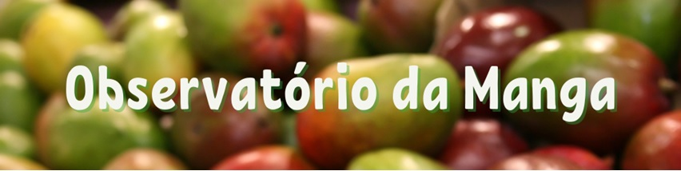

```{r setup, include=FALSE}
knitr::opts_chunk$set(
  echo       = FALSE,
  warning    = FALSE,
  message    = FALSE,
  comment    = NA,
  fig.width  = 9, 
  fig.height = 6,
  fig.align  = "center",
  comment    = "#",
  size       = "normalsize"
  )

library(lubridate)
today <- as.Date("2022-01-01")
date <- seq(as.Date('2021-01-01'),to=as.Date('2021-12-01'),by='1 month')
atual <-  as.Date("2022-01-01")

#Linhas precisam de ajuste semanal: 30, 104, 201, 204
```

```{r tratamento_base}
#Direcionado o R para o Diretorio a ser trabalhado
setwd('c:/Users/Joao Ricardo Lima/Dropbox/tempecon/dados_manga')

#Inicio do Script
#Pacotes a serem utilizados
library(mFilter)
library(forecast)
library(tsutils)
library(seasonal)
library(ggplot2)
library(uroot)
library(tseries)
library(ggthemes)
library(dplyr)
library(tidyverse)
library(quantmod)
library(scales)
library(kableExtra)# complex tables
library(lmtest)
library(FinTS)
library(magrittr)# pipe operations
library(readxl)
library(reshape2)
library(plotly)
library(DT)

checkX13()

options(digits=4)

#Dados de manga por estados

dados3 <- read_excel("ceasas_mi_total22.xlsx", col_names = FALSE)
dados3 <- dados3[,-1]

#Transpor a base de dados
dados3 <- as.data.frame(t(dados3))
colnames(dados3) <-c ('ano','produto','origem','unidade','quilos')
dados3 <- dados3 %>%
  mutate(quilos=as.numeric(quilos))

#Total de mangas em todos os CEASAS todas as UF

manga_anual_all <- dados3 %>% group_by(ano) %>% summarise(quilos=sum(quilos))
manga_anual_all$todas_UF <- (manga_anual_all$quilos)/1000 #transformando em Toneladas
manga_anual_all <- manga_anual_all[,-2]

#Total de mangas em todos os CEASAS PE + BA

manga_anual_pe <- dados3 %>% filter(origem=='PE')
manga_anual_ba <- dados3 %>% filter(origem=='BA')

manga_total_peba <- tibble(manga_anual_pe$quilos + manga_anual_ba$quilos)
manga_total_peba <- manga_total_peba/1000 #passando o volume para toneladas
colnames(manga_total_peba)[1]<-'pe+ba'

#Juntando as bases de dados Total e PEBA
manga_anual_all <- tibble(manga_anual_all, manga_total_peba)
manga_anual_all$ano <- seq(as.Date('2017-01-01'),to=today,by='1 year')
manga_anual_allm <- melt(manga_anual_all, id.var='ano')

# Variação da oferta

dados4 <- read_excel("ceasas_mi_peba_mensal22.xlsx", col_names = FALSE)
dados4 <- dados4[,-1]

#Transpor a base de dados
dados4 <- as.data.frame(t(dados4))
colnames(dados4) <-c ('ano','mes','produto','origem','unidade','quilos')
dados4 <- dados4 %>%
  mutate(quilos=as.numeric(quilos))

# Geração da variável Tommy
manga_mespe <-  dados4 %>%
  filter(origem == "PE")

manga_mesba <-  dados4 %>%
  filter(origem == "BA")

manga_mespeba <- tibble((manga_mespe$quilos + manga_mesba$quilos)/1000)
manga_mespeba$mes <- seq(as.Date('2017-01-01'),to=today,by='1 month')
manga_mespeba$ano <- manga_mespe$ano
colnames(manga_mespeba)[1] <-'toneladas'

totalpeba_20 <- manga_mespeba %>% filter(ano=='2020')
totalpeba_21 <- manga_mespeba %>% filter(ano=='2021')
totalpeba_22 <- manga_mespeba %>% filter(ano=='2022')

totalpeba_var20 <- as.matrix(totalpeba_20$toneladas)
totalpeba_var21 <- as.matrix(totalpeba_21$toneladas)
totalpeba_var22 <- as.matrix(totalpeba_22$toneladas)

variacaopeba_2120 <- ((totalpeba_var21-totalpeba_var20)/totalpeba_var20)*100
variacaopeba_2221a <- as.matrix((totalpeba_var22[1,1]-totalpeba_var21[1,1])/totalpeba_var21[1,1])*100

variacaopeba_2221 <- matrix(NA, nrow=12, ncol=1)

for(i in 1:1){
  variacaopeba_2221[i,1] = variacaopeba_2221a[i,1]
}

#meses <- seq(1:12)
variacao_totalpeba <- data.frame(date, variacaopeba_2120, variacaopeba_2221)
colnames(variacao_totalpeba) = c('Meses', 'Ano 2021', 'Ano 2022')

variacao_totalpebat <- melt(variacao_totalpeba, id.var='Meses')

#Tendencia PEBA
manga_mespeba2 <- ts(manga_mespeba$toneladas, start = c(2017,1), freq=12)
trend_peba <- cmav(manga_mespeba2, outplot=F)

#Sazonalidade PEBA
decompa_peba<-decompose(manga_mespeba2, type = 'multiplicative')
sazonal_peba <- decompa_peba$figure
meses <- seq(as.Date("2021/1/1"), by = "month", length.out = 12)
sazonalpeba_graph <- tibble(meses, sazonal_peba)


#Comparações com os anos e entre as médias/max/min

peba_2019 <- window(manga_mespeba2, end=c(2019,12))
seaspeba_19<-seasplot(peba_2019, trend=F, outplot = F)
mediaspeba_19 <- colMeans(seaspeba_19$season)

peba_2020 <- window(manga_mespeba2, end=c(2020,12))

peba_2021 <- window(manga_mespeba2, end=c(2021,12))
#seas21<-seasplot(preco_palmer_2021, trend=F, outplot = F)
#medias21 <- colMeans(seas21$season)

peba_22 <- as.matrix(tail(manga_mespeba2,1)) #ajustar mensalmente
peba_2022 <- matrix(NA, nrow=12, ncol=1)

for(i in 1:1){
  peba_2022[i,1] = peba_22[i,1]
}

#Como só se tem até a semana 12
mediaspeba_19 <- mediaspeba_19[1:12]

matrixpeba = matrix(NA, nrow=12, ncol=2)

for(i in 1:12){
  matrixpeba[i,1] = min(seaspeba_19$season[,i])
  matrixpeba[i,2] = max(seaspeba_19$season[,i])
}

#time <- c("Janeiro", "Fevereiro", "Março", "Abril", "Maio", "Junho", "Julho", "Agosto", "Setembro", "Outubro", "Novembro", #"Dezembro")
#time <-seq(1:12)
table_peba <- data.frame(meses, matrixpeba[,1], round(mediaspeba_19,1), matrixpeba[,2],
                         round(tail(peba_2020,12),1),
                    round(tail(peba_2021,12),1), peba_2022[,1])
colnames(table_peba) = c('Meses', 'Mínimo', 'Média', 'Máximo', '2020', '2021',
                    '2022')

tablepeba_a <- table_peba[,-c(5:7)]
tablepeba_b <- table_peba[,-c(2,3,4)]

tablepeba_a2 <- melt(tablepeba_a, id.var='Meses')
tablepeba_b2 <- melt(tablepeba_b, id.var='Meses')
mycolors <- c("lightblue3", "gray44", "gold")
mycolor1 <- "gold"
mycolors2 <- c("orange", "lightblue3")
```

<br>

# ANÁLISE DA OFERTA DE MANGA NOS CEASAS ATÉ O MÊS DE `r toupper(strftime(atual, format = "%B"))`

<br>

Os dados utilizados nesta análise são mensais e disponibilizados pela *CONAB/PROHORT*. São para a oferta de manga comercializados nos CEASAS do Brasil com origem em todos os estados e comparados com o volume de origem Pernambuco e Bahia. O período disponibilizado é de **janeiro de 2017 à janeiro de 2022**;

Em relação aos *volumes (total e com origem Pernambuco e Bahia)*, em 2017, 54,67% do volume total teve origem PE e BA. Em 2021, este volume passou para 61,88%. No mes de janeiro de 2022 os volumes do Vale do São Francisco são normalmente menores e, com as chuvas, reduziram ainda mais, atingindo os 43,76%;  

A informação da variação do volume, comparando janeiro de 2022 com 2021, mostra uma queda de -6,71%, cenário bem diferente do que ocorreu em 2021 com 2020, quando o volume foi 32,18% mais elevado. Contudo, segue a conjuntura de dezembro de 2021, quando o volume já tinha sido 32,42% em relação ao ao anterior;

A **Tendência** ente 2017 e 2022 não mostra crescimento significativo do volume. A **Sazonalidade** mostra o crescimento da oferta até maio e, depois de uma estabilidade até agosto, se tem um novo crescimento até outubro, quando atinge o pico de oferta;

A comparação da média, mínimo valor e máximo valor (até 2019) com os valores de 2020, 2021 e 2022 mostra que nos últimos anos os volumes foram maiores do que o que se teve de máximo até 2019. Mostra também que, em 2021, na maior parte dos meses, os volumes superaram muito os valores de 2020 e foram acima da média histórica.

<br>

# 1. Volume total comercializado de manga: 2017 a 2022
## Evolução do total e dos volumes apenas de Pernambuco e Bahia {.tabset .tabset-fade}

<br>

### GRÁFICO

```{r mi1}
## Gráfico Total de Mangas e Mangas PE+BA

g1 <- ggplot()+
  geom_col(data=manga_anual_allm, aes(x=ano, y=value, fill=variable), lwd=1, position = "dodge")+
  scale_fill_manual(values=mycolors2)+
  scale_y_continuous(limits = c(0, 350000), n.breaks = 10)+
  scale_x_date(date_breaks = "1 year", labels = date_format("%Y"))+
  labs(y= "Toneladas", x= "Anos", title='',
       caption = "Fonte: PROHORT/CONAB reprocessado pelo Observatório de Mercado de Manga da Embrapa")+
  theme_minimal()+
  theme(axis.text.x=element_text(angle=0, hjust=0.5, size=14, margin = margin(b=20)),
        axis.text.y=element_text(hjust=0.5, size=14, margin = margin(l=20)),
        axis.title.y = element_text(size=16, face = "bold"),
        axis.title.x = element_text(size=16, face = "bold"),
        panel.grid.major = element_blank(),
        panel.grid.minor = element_blank(),
        plot.caption = element_text(hjust = 0, size=14),
        legend.position = "bottom", legend.title = element_blank(),
        legend.text=element_text(size=12)) # Definindo posição da legenda

ggplotly(g1) %>%
  layout(legend = list(
                      orientation = "h", 
                      x=0.30, 
                      y=-0.25,
                      title=''))
```
\footnotesize Obs: Dados de 2022 apenas para o mês de janeiro.

<br>

### TABELA

**VISUALIZAÇÃO DOS DADOS EM TABELA (TONELADAS)**

```{r mit}
#tableP <-table[,-1]
#rmarkdown::paged_table(round(tableD,2))
manga_anual_alltab <- manga_anual_all
manga_anual_alltab[,1] <- seq(2017, 2022, by = 1)
colnames(manga_anual_alltab) <- c('Ano', 'Total', 'Pernambuco + Bahia')
datatable(round(manga_anual_alltab), option = list(
  autoWidth = TRUE,
  pageLength = 10,
  columnDefs = list(list(className = 'dt-center', targets = "_all"))))
```
Fonte:PROHORT/CONAB reprocessado pelo Observatório de Mercado de Manga da Embrapa

Obs: Dados de 2022 apenas para o mês de janeiro.

<br>
<br>

# 2. Variação do Volume comercializado de manga: 2017 a 2022 
## Manga com origem em Pernambuco e na Bahia {.tabset .tabset-fade}

<br>

### GRÁFICO

<br>

```{r mi2}
#Variação Volume PE+BA

g2 <- ggplot()+
  geom_col(data=variacao_totalpebat, aes(x=Meses, y=value, fill=variable), lwd=1, position = "dodge")+
  scale_fill_manual(values=mycolors2)+
  scale_y_continuous(limits = c(-40, 60), n.breaks = 10)+
  scale_x_date(date_breaks = "1 month",
               labels = date_format("%B"))+
  labs(y= "Variação Percentual (%)", x= "Meses do Ano", title='',
       caption = "Fonte: Observatório de Mercado de Manga da Embrapa")+
  theme_minimal()+
  theme(axis.text.x=element_text(angle=35, hjust=0.5, size=14, margin = margin(b=20)),
        axis.text.y=element_text(hjust=0.5, size=14, margin = margin(l=20)),
        axis.title.y = element_text(size=16, face = "bold"),
        axis.title.x = element_text(size=16, face = "bold"),
        panel.grid.major = element_blank(),
        panel.grid.minor = element_blank(),
        plot.caption = element_text(hjust = 0, size=14),
        legend.position = "bottom", legend.title = element_blank(),
        legend.text=element_text(size=12)) # Definindo posição da legenda

ggplotly(g2) %>%
  layout(legend = list(
                      orientation = "h", 
                      x=0.35, 
                      y=-0.25,
                      title=''))
```

<br>

### TABELA

**VISUALIZAÇÃO DOS DADOS EM TABELA (VARIAÇÃO PERCENTUAL %)**

```{r mi2t}
variacao_totalpeba_tab <- variacao_totalpeba
variacao_totalpeba_tab$`Ano 2021` <- round(variacao_totalpeba_tab$`Ano 2021`,2)
variacao_totalpeba_tab$`Ano 2022` <- round(variacao_totalpeba_tab$`Ano 2022`,2)
variacao_totalpeba_tab$Meses <- c('Janeiro', 'Fevereiro', 'Março', 'Abril', 'Maio',
  'Junho', 'Julho', 'Agosto', 'Setembro', 'Outubro', 'Novembro', 'Dezembro') 
datatable(variacao_totalpeba_tab, option = list(
  autoWidth = TRUE,
  pageLength = 12,
  columnDefs = list(list(className = 'dt-center', targets = "_all"))))
```
Fonte:PROHORT/CONAB reprocessado pelo Observatório de Mercado de Manga da Embrapa

Obs: Dados de 2022 apenas para o mês de janeiro.

# 3. Tendência do Volume comercializado de manga: 2017 a 2022 
## Manga com origem em Pernambuco e na Bahia

<br>

```{r mi3}
#Gráfico com Ggplot2 - Tendencia

g3 <- ggplot(data=manga_mespeba, aes(x=mes)) +  #estetica vai valer para todos os geom's
  geom_line(aes(y=toneladas, colour="TONELADAS"), lwd=1)+
  geom_line(aes(y=trend_peba, colour="TENDÊNCIA"), lwd=1)+
  scale_colour_manual("",
                      breaks = c("TONELADAS", "TENDÊNCIA"),
                      values = c("blue", "red")) +
  labs(y= "Quantidade (T)", x= "Meses do Ano", title='',
       caption = "Fonte: CONAB reprocessado pelo Observatório de Mercado de Manga da Embrapa")+
  scale_y_continuous(limits=c(0,25000), n.breaks = 10, expand = expansion(add=c(0,0.5)))+
  scale_x_date(date_breaks = "1 year",
               labels = date_format("%Y"))+
  theme_classic()+ #Definindo tema
  theme(axis.text.x=element_text(angle=35, hjust=0.5, size=14, margin = margin(b=10)),
        axis.text.y=element_text(hjust=1, size=14, margin = margin(l=20)),
        axis.title.x = element_text(size=16, face = "bold", margin = margin(b=0)),
        axis.title.y = element_text(size=16, face = "bold", margin = margin(l=20)),
        plot.title = element_text(hjust = 0.5, size=16, face="italic"),
        plot.caption = element_text(hjust = 0, size=12),
        legend.position = "bottom", legend.title = element_blank(),
        legend.text=element_text(size=12)) # Definindo posição da legenda

ggplotly(g3) %>%
  layout(legend = list(
                      orientation = "h", 
                      x=0.30, 
                      y=-0.25,
                      title=''))
```

<br>

# 4. Sazonalidade do Volume comercializado de manga: 2017 a 2022 
## Manga com origem em Pernambuco e na Bahia

<br>

```{r mi4}
# Gráfico da Sazonalidade

g4 <- ggplot(data=sazonalpeba_graph)+
  geom_line(aes(x=meses, y=sazonal_peba), color="blue", size=1.5)+
  scale_y_continuous(limits=c(0,2), n.breaks = 5, expand = expansion(add=c(0,0.5)),
                     labels=number_format(accuracy = 0.1)) +
  scale_x_date(date_breaks = "1 month",
               labels = date_format("%b"))+
  labs(y= "", x= "Meses de cada Ano", title='',
       caption = "Observatório de Mercado de Manga da Embrapa")+
  theme_minimal()+
  theme(axis.text.x=element_text(angle=0, hjust=0.5, size=14, margin = margin(b=20)),
        axis.text.y=element_text(hjust=0.5, size=14, margin = margin(l=20)),
        axis.title.y = element_text(size=14, face = "bold"),
        axis.title.x = element_text(size=14, face = "bold"),
        panel.grid.major = element_blank(),
        panel.grid.minor = element_blank(),
        plot.caption = element_text(hjust = 0, size=14),
        legend.position = "bottom", legend.title = element_blank(),
        legend.text=element_text(size=12)) # Definindo posição da legenda

ggplotly(g4) %>%
  layout(legend = list(
                      orientation = "h", 
                      x=0.30, 
                      y=-0.25,
                      title=''))
```

<br>

# 5. Estatísticas sobre a Evolução da Oferta de manga
## Manga com origem em Pernambuco e na Bahia{.tabset .tabset-fade}

<br>

### GRÁFICO

<br>

```{r mi5}
#Evolução da Oferta Mensal de Manga PEBA nos CEASAS do Brasil

g5 <- ggplot()+
  geom_col(data=tablepeba_b2, aes(x=Meses, y=value, fill=variable), lwd=1,
           position = "dodge")+
  scale_fill_manual(values=mycolors)+
  geom_line(data=tablepeba_a2, aes(x=Meses, y=value, colour=variable), linetype = "solid",
            size = 1)+
  scale_colour_manual(values = c("red", "chocolate", "darkgreen")) +
  scale_y_continuous(limits = c(0, 22000), n.breaks = 10)+
  scale_x_date(date_breaks = "1 month",
               labels = date_format("%B"))+
  labs(y= "Toneladas", x= "Meses do Ano", title='',
       caption = "")+
  theme_minimal()+
  theme(axis.text.x=element_text(angle=35, hjust=0.5, size=12, margin = margin(b=20)),
        axis.text.y=element_text(hjust=0.5, size=14, margin = margin(l=20)),
        axis.title.y = element_text(size=14, face = "bold"),
        axis.title.x = element_text(size=14, face = "bold"),
        panel.grid.major = element_blank(),
        panel.grid.minor = element_blank(),
        plot.caption = element_text(hjust = 0, size=14),
        legend.position = "bottom", legend.title = element_blank(),
        legend.text=element_text(size=11)) # Definindo posição da legenda

ggplotly(g5) %>%
  layout(legend = list(
                      orientation = "h", 
                      x=0.05, 
                      y=-0.25,
                      title=''))
```
Obs: Mínimo, Média e Máximo considera apenas o período de 2017 a 2019.

<br>

### TABELA
**VISUALIZAÇÃO DOS DADOS EM TABELA (TONELADAS)**

<br>

```{r mi5t}
table_pebat <- table_peba
table_pebat$Meses <- c('Janeiro', 'Fevereiro', 'Março', 'Abril', 'Maio',
  'Junho', 'Julho', 'Agosto', 'Setembro', 'Outubro', 'Novembro', 'Dezembro') 
datatable(table_pebat, option = list(
  autoWidth = TRUE,
  pageLength = 12,
  columnDefs = list(list(className = 'dt-center', targets = "_all"))))
```

# INFORMAÇÕES

<br>
<br>

<center>{width=16cm}</center>

<br>
<br>

<center> João Ricardo F. de Lima </center>
<center> Email: joao.ricardo@embrapa.br </center>

<br>

<center> [https://www.embrapa.br/observatorio-da-manga](https://www.embrapa.br/observatorio-da-manga) </center>

<br>

<center> Telefones: </center>
<center> 87-3866-3667 </center> 
<center> 87-99961-5799 </center>

<br>

<center>{width=6cm}</center>

<br>
<br>
