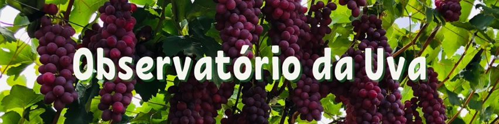

```{r setup, include=FALSE}
knitr::opts_chunk$set(
  echo       = FALSE,
  warning    = FALSE,
  message    = FALSE,
  comment    = NA,
  fig.width  = 8,
  fig.height = 5,
  fig.align  = "center",
  comment    = "#",
  size       = "normalsize"
  )

library(lubridate)
today <- today <- as.Date("2021-01-01")
date <- seq(as.Date('2021-01-01'),to=as.Date('2021-12-01'),by='1 month')

#Linhas precisam de ajuste semanal: 30, 104, 201, 204
```

<br>

# ATUALIZAÇÃO DA INFORMAÇÕES SOBRE A CULTURA DA UVA COM DADOS DA PAM/IBGE ATÉ 2021.

<br>

Os dados utilizados são da Pesquisa Agrícola Municipal (PAM) do IBGE e relativos ao período de 2015 a 2021, excluindo o estado do Rio Grande do Sul (que possui muita uva para vinho e suco) dado que o interesse aqui é com uva de mesa. Em 2021, a área plantada no Brasil foi de aproximadamente 29,4 mil hectares (ha). As três regiões que concentram a produção nacional são a Nordeste 11,5 mil ha (39,1% do total), a Sudeste 10,2 mil ha (34,6% do total) e a Sul (Paraná e Santa Catarina) com 7,5 mil ha (25,6%). Os estados de Pernambuco (8,8 mil ha); São Paulo (8,6 mil ha); Santa Catarina (3,9 mil ha), Paraná (3,6 mil ha), Bahia (2,45 mil ha ) e Minas Gerais (1,3 mil ha) representam, respectivamente, 30,08%, 29,40%, 13,40%, 12,19%, 8,46% e 4,42% do total nacional. O Vale do São Francisco mantém sua trajetória de crescimento de área, saindo de 9,1 mil ha em 2015 para 10,6 mil ha em 2021, segundo o IBGE (2022), um aumento de 17,49%.

Em termos de volumes, o Brasil colheu cerca de 796,9 mil toneladas (t), com o Nordeste participando com aproximadamente 62% de todo este volume. Os seis estados com maiores volumes de produção são, respectivamente, Pernambuco (52,7%), São Paulo (21,17%), Bahia (8,88%), Santa Catarina (7,49%), Paraná ( 5,77%) e Minas Gerais (2,49%). O Vale do São Francisco produziu cerca de 473,9 mil toneladas, um crescimento de 57,38% em relação ao volume de 2015. 

Sobre a produtividade, a média da região Nordeste (43 t/ha) é maior do que a média nacional (27 t/ha). Segundo o IBGE (2022), o estado de Pernambuco possui a maior produtividade média (47,6 t/ha), seguido da Bahia (28,5 t/ha) e São Paulo (19.5 t/ha). O Vale do São Francisco possui uma produtividade superior a média regional, superando as 44 t/ha, na média. No ano de 2015, a produtividade nesta região foi de 33 t/ha. Assim, a explicação para o grande crescimento do volume de uvas no Vale do São Francisco tem dois fatores, o crescimento da área e o crescimento da produtividade por área. 

A uva gera quase 3 bilhões de reais em valor da produção no Brasil, sendo que mais da metade deste total 1,8 bilhões de reais é no Vale do São Francisco. 

<br>

# 1. ATUALIZAÇÃO DADOS SOBRE ÁREA DA CULTURA DA UVA.

## 1.1 ÁREA NO BRASIL E PRINCIPAIS REGIÕES PRODUTORAS{.tabset .tabset-fade}

### GRÁFICO

<br>

```{r ibge_uva1}
#Direcionado o R para o Diretorio a ser trabalhado
setwd('/Users/jricardofl/Dropbox/tempecon/dados_uva/2022')

#Inicio do Script
#Pacotes a serem utilizados 
library(ggplot2)
library(ggthemes)
library(dplyr)
library(tidyverse)
library(scales)
library(kableExtra)# complex tables
library(magrittr)# pipe operations
library(readxl)
library(reshape2)
library(plotly)
library(DT)

mycolors2 <- c("darkgray", "lightblue3", "orange", "darkblue", "red", "darkgreen", "gold")
mycolors3 <- c("darkblue", "orange")

#Entrando dados no R
dados1 <- read_excel("area_regioes.xlsx", col_names = TRUE)
#dados1 <- dados1[c(1,3,4),]
dados1m <- melt(dados1, id.var='regiao')

g1 <- ggplot()+
  geom_col(data=dados1m, aes(x=reorder(regiao, -value), y=value/1000, fill=variable), lwd=1, position = "dodge")+ scale_fill_manual(values=mycolors2)+
  labs(y= "Área Plantada de Uva (1000 ha)", x= "Brasil e Regiões", title='',
       caption = "Fonte: PAM/IBGE reprocessado pelo Observatório de Mercado de Uva da Embrapa")+
  theme_minimal()+
  theme(axis.text.x=element_text(angle=0, hjust=0.5, size=12, margin = margin(b=20)),
        axis.text.y=element_text(hjust=0.5, size=12, margin = margin(l=20)),
        axis.title.y = element_text(size=12, face = "bold"),
        axis.title.x = element_text(size=12, face = "bold"),
        panel.grid.major = element_blank(),
        panel.grid.minor = element_blank(),
        plot.title = element_text(hjust = 0.5, size=12),
        plot.caption = element_text(hjust = 0, size=12),
        legend.position = "bottom", legend.title = element_blank(),
        legend.text=element_text(size=12)) # Definindo posição da legenda

ggplotly(g1) %>%
  layout(legend = list(
    orientation = "h",
    x=0.1,
    y=-0.2,
    title=''))
```
Fonte: PAM/IBGE reprocessado pelo Observatório de Mercado de Uva da Embrapa

<br>
<br>

### TABELA 

**VISUALIZAÇÃO DOS DADOS EM TABELA**

```{r ibge_uva1a}
datatable(dados1, option = list(
  autoWidth = TRUE,
  columnDefs = list(list(className = 'dt-center', targets = "_all"))))

#kable(round(table,2)) %>%
#  kable_styling(full_width = T, bootstrap_options = c("striped", "hover", "condensed"))
```
Fonte: PAM/IBGE reprocessado pelo Observatório de Mercado de Uva da Embrapa

<br>
<br>

## 1.2 ÁREA NOS PRINCIPAIS ESTADOS PRODUTORES{.tabset .tabset-fade}

### GRÁFICO

<br>

```{r ibge_uva2}
#Direcionado o R para o Diretorio a ser trabalhado
setwd('/Users/jricardofl/Dropbox/tempecon/dados_uva/2022')

#Entrando dados no R
dados2 <- read_excel("area_estados.xlsx", col_names = TRUE)
dados2 <- dados2[c(2:7),]
dados2m <- melt(dados2, id.var='estados')

g2 <- ggplot()+
  geom_col(data=dados2m, aes(x=reorder(estados, -value), y=value/1000, fill=variable), lwd=1, position = "dodge")+ scale_fill_manual(values=mycolors2)+
  labs(y= "Área Plantada de Uva (1000 ha)", x= "Estados do Brasil", title='',
       caption = "Fonte: PAM/IBGE reprocessado pelo Observatório de Mercado de Uva da Embrapa")+
  theme_minimal()+
  theme(axis.text.x=element_text(angle=0, hjust=0.5, size=12, margin = margin(b=20)),
        axis.text.y=element_text(hjust=0.5, size=12, margin = margin(l=20)),
        axis.title.y = element_text(size=10, face = "bold"),
        axis.title.x = element_text(size=10, face = "bold"),
        panel.grid.major = element_blank(),
        panel.grid.minor = element_blank(),
        plot.title = element_text(hjust = 0.5, size=12),
        plot.caption = element_text(hjust = 0, size=12),
        legend.position = "bottom", legend.title = element_blank(),
        legend.text=element_text(size=12)) # Definindo posição da legenda

ggplotly(g2) %>%
  layout(legend = list(
    orientation = "h",
    x=0.1,
    y=-0.2,
    title=''))
```
Fonte: PAM/IBGE reprocessado pelo Observatório de Mercado de Uva da Embrapa

<br>
<br>

### TABELA 

**VISUALIZAÇÃO DOS DADOS EM TABELA**

```{r ibge_uva2a}
datatable(dados2, option = list(
  autoWidth = TRUE,
  columnDefs = list(list(className = 'dt-center', targets = "_all"))))

#kable(round(table,2)) %>%
#  kable_styling(full_width = T, bootstrap_options = c("striped", "hover", "condensed"))
```
Fonte: PAM/IBGE reprocessado pelo Observatório de Mercado de Uva da Embrapa

<br>
<br>

## 1.3 ÁREA NAS PRINCIPAIS CIDADES PRODUTORAS{.tabset .tabset-fade}

### GRÁFICO

<br>

```{r ibge_uva3}
#Direcionado o R para o Diretorio a ser trabalhado
#Entrando dados no R
setwd('/Users/jricardofl/Dropbox/tempecon/dados_uva/2022')

dados3 <- read_excel("area_cidades.xlsx", col_names = TRUE)
dados3 <- dados3[c(1,8,10,12,14,20,22,27,29:33,36,37,41,42),c(1,7:8)]
dados3m <- melt(dados3, id.var='cidades')

g3 <- ggplot()+
  geom_col(data=dados3m, aes(x=reorder(cidades, -value), y=value, fill=variable), lwd=1, position = "dodge")+ scale_fill_manual(values=mycolors3)+
  labs(y= "Área Plantada de Uva (ha)", x= "Cidades do Brasil", title='',
       caption = "Fonte: PAM/IBGE reprocessado pelo Observatório de Mercado de Uva da Embrapa")+
  theme_minimal()+
  theme(axis.text.x=element_text(angle=20, hjust=0.5, size=8, margin = margin(b=20)),
        axis.text.y=element_text(hjust=0.5, size=8, margin = margin(l=20)),
        axis.title.y = element_text(size=10, face = "bold"),
        axis.title.x = element_text(size=10, face = "bold"),
        panel.grid.major = element_blank(),
        panel.grid.minor = element_blank(),
        plot.title = element_text(hjust = 0.5, size=12),
        plot.caption = element_text(hjust = 0, size=12),
        legend.position = "bottom", legend.title = element_blank(),
        legend.text=element_text(size=12)) # Definindo posição da legenda

ggplotly(g3) %>%
  layout(legend = list(
    orientation = "h",
    x=0.35,
    y=-0.35,
    title=''))
```
Fonte: PAM/IBGE reprocessado pelo Observatório de Mercado de Uva da Embrapa

<br>
<br>

### TABELA 

**VISUALIZAÇÃO DOS DADOS EM TABELA**

```{r ibge_uva3a}
datatable(dados3, option = list(
  autoWidth = TRUE,
  columnDefs = list(list(className = 'dt-center', targets = "_all"))))

#kable(round(table,2)) %>%
#  kable_styling(full_width = T, bootstrap_options = c("striped", "hover", "condensed"))
```
Fonte: PAM/IBGE reprocessado pelo Observatório de Mercado de uva da Embrapa

<br>
<br>

## 1.4 ÁREA NO VALE DO S. FRANCISCO {.tabset .tabset-fade}

### GRÁFICO

<br>

```{r ibge_uva4}
#Direcionado o R para o Diretorio a ser trabalhado
#Entrando dados no R
setwd('/Users/jricardofl/Dropbox/tempecon/dados_uva/2022')

dados4 <- read_excel("area_vale.xlsx", col_names = TRUE)
dados4m <- melt(dados4, id.var='cidades')
mycolors4 <- "blue"

g4 <- ggplot()+
  geom_col(data=dados4m, aes(x=variable, y=value/1000, fill="Area Uva (Hectares)"), lwd=1)+
  scale_fill_manual(values=mycolors4)+
  labs(y= "Área Plantada de Uva (mil ha)", x= "Vale do São Francisco", title='',
       caption = "Fonte: PAM/IBGE reprocessado pelo Observatório de Mercado de Uva da Embrapa")+
  theme_minimal()+
  theme(axis.text.x=element_text(angle=0, hjust=0.5, size=12, margin = margin(b=20)),
        axis.text.y=element_text(hjust=0.5, size=12, margin = margin(l=20)),
        axis.title.y = element_text(size=12, face = "bold"),
        axis.title.x = element_text(size=12, face = "bold"),
        panel.grid.major = element_blank(),
        panel.grid.minor = element_blank(),
        plot.title = element_text(hjust = 0.5, size=12),
        plot.caption = element_text(hjust = 0, size=12),
        legend.position = "bottom", legend.title = element_blank(),
        legend.text=element_text(size=12)) # Definindo posição da legenda

ggplotly(g4) %>%
  layout(legend = list(
    orientation = "h",
    x=0.3,
    y=-0.2,
    title=''))
```
Fonte: PAM/IBGE reprocessado pelo Observatório de Mercado de Uva da Embrapa

<br>
<br>

### TABELA 

**VISUALIZAÇÃO DOS DADOS EM TABELA**

```{r ibge_uva4a}
datatable(dados4, option = list(
  autoWidth = TRUE,
  columnDefs = list(list(className = 'dt-center', targets = "_all"))))

#kable(round(table,2)) %>%
#  kable_styling(full_width = T, bootstrap_options = c("striped", "hover", "condensed"))
```
Fonte: PAM/IBGE reprocessado pelo Observatório de Mercado de uva da Embrapa

<br>
<br>


# 2. ATUALIZAÇÃO DADOS SOBRE PRODUÇÃO DA CULTURA DA UVA.

## 2.1 QUANTIDADE NO BRASIL E PRINCIPAIS REGIÕES PRODUTORAS{.tabset .tabset-fade}

### GRÁFICO

<br>

```{r ibge_uva5}
#Direcionado o R para o Diretorio a ser trabalhado
setwd('/Users/jricardofl/Dropbox/tempecon/dados_uva/2022')

#Entrando dados no R
dados1 <- read_excel("quanti_regioes.xlsx", col_names = TRUE)
dados1 <- dados1[c(1,3,4,5),]
dados1m <- melt(dados1, id.var='regiao')

g1 <- ggplot()+
  geom_col(data=dados1m, aes(x=reorder(regiao, -value), y=value/1000, fill=variable), lwd=1, position = "dodge")+ scale_fill_manual(values=mycolors2)+
  labs(y= "Quantidade Produzida de Uva (Mil t)", x= "Brasil e Regiões", title='',
       caption = "Fonte: PAM/IBGE reprocessado pelo Observatório de Mercado de Uva da Embrapa")+
  theme_minimal()+
  theme(axis.text.x=element_text(angle=0, hjust=0.5, size=12, margin = margin(b=20)),
        axis.text.y=element_text(hjust=0.5, size=12, margin = margin(l=20)),
        axis.title.y = element_text(size=12, face = "bold"),
        axis.title.x = element_text(size=12, face = "bold"),
        panel.grid.major = element_blank(),
        panel.grid.minor = element_blank(),
        plot.title = element_text(hjust = 0.5, size=12),
        plot.caption = element_text(hjust = 0, size=12),
        legend.position = "bottom", legend.title = element_blank(),
        legend.text=element_text(size=12)) # Definindo posição da legenda

ggplotly(g1) %>%
  layout(legend = list(
    orientation = "h",
    x=0.1,
    y=-0.2,
    title=''))
```
Fonte: PAM/IBGE reprocessado pelo Observatório de Mercado de Uva da Embrapa

<br>
<br>

### TABELA 

**VISUALIZAÇÃO DOS DADOS EM TABELA**

```{r ibge_uva5a}
datatable(dados1, option = list(
  autoWidth = TRUE,
  columnDefs = list(list(className = 'dt-center', targets = "_all"))))

#kable(round(table,2)) %>%
#  kable_styling(full_width = T, bootstrap_options = c("striped", "hover", "condensed"))
```
Fonte: PAM/IBGE reprocessado pelo Observatório de Mercado de Uva da Embrapa

<br>
<br>

## 2.2 QUANTIDADE NOS PRINCIPAIS ESTADOS PRODUTORES{.tabset .tabset-fade}

### GRÁFICO

<br>

```{r ibge_uva6}
#Direcionado o R para o Diretorio a ser trabalhado
setwd('/Users/jricardofl/Dropbox/tempecon/dados_uva/2022')

#Entrando dados no R
dados2 <- read_excel("quanti_estados.xlsx", col_names = TRUE)
dados2 <- dados2[c(1:6),]
dados2m <- melt(dados2, id.var='estados')

g2 <- ggplot()+
  geom_col(data=dados2m, aes(x=reorder(estados, -value), y=value/1000, fill=variable), lwd=1, position = "dodge")+ scale_fill_manual(values=mycolors2)+
  labs(y= "Quantidade Produzida de Uva (Mil t)", x= "Estados do Brasil", title='',
       caption = "Fonte: PAM/IBGE reprocessado pelo Observatório de Mercado de Uva da Embrapa")+
  theme_minimal()+
  theme(axis.text.x=element_text(angle=0, hjust=0.5, size=12, margin = margin(b=20)),
        axis.text.y=element_text(hjust=0.5, size=12, margin = margin(l=20)),
        axis.title.y = element_text(size=10, face = "bold"),
        axis.title.x = element_text(size=10, face = "bold"),
        panel.grid.major = element_blank(),
        panel.grid.minor = element_blank(),
        plot.title = element_text(hjust = 0.5, size=12),
        plot.caption = element_text(hjust = 0, size=12),
        legend.position = "bottom", legend.title = element_blank(),
        legend.text=element_text(size=12)) # Definindo posição da legenda

ggplotly(g2) %>%
  layout(legend = list(
    orientation = "h",
    x=0.1,
    y=-0.2,
    title=''))
```
Fonte: PAM/IBGE reprocessado pelo Observatório de Mercado de Uva da Embrapa

<br>
<br>

### TABELA 

**VISUALIZAÇÃO DOS DADOS EM TABELA**

```{r ibge_uva6a}
datatable(dados2, option = list(
  autoWidth = TRUE,
  columnDefs = list(list(className = 'dt-center', targets = "_all"))))

#kable(round(table,2)) %>%
#  kable_styling(full_width = T, bootstrap_options = c("striped", "hover", "condensed"))
```
Fonte: PAM/IBGE reprocessado pelo Observatório de Mercado de Uva da Embrapa

<br>
<br>

## 2.3 QUANTIDADE NAS PRINCIPAIS CIDADES PRODUTORAS{.tabset .tabset-fade}

### GRÁFICO

<br>

```{r ibge_uva7}
#Direcionado o R para o Diretorio a ser trabalhado
#Entrando dados no R
setwd('/Users/jricardofl/Dropbox/tempecon/dados_uva/2022')

dados3 <- read_excel("quanti_cidades.xlsx", col_names = TRUE)
dados3 <- dados3[c(1,4,9,12,14,19,21,23,24,27,29,30,33,35,39),c(1,7:8)]
dados3m <- melt(dados3, id.var='cidades')

g3 <- ggplot()+
  geom_col(data=dados3m, aes(x=reorder(cidades, -value), y=value/1000, fill=variable), lwd=1, position = "dodge")+ scale_fill_manual(values=mycolors3)+
  labs(y= "Quantidade Produzida de Uva (Mil t)", x= "Cidades do Brasil", title='',
       caption = "Fonte: PAM/IBGE reprocessado pelo Observatório de Mercado de Uva da Embrapa")+
  theme_minimal()+
  theme(axis.text.x=element_text(angle=20, hjust=0.5, size=8, margin = margin(b=20)),
        axis.text.y=element_text(hjust=0.5, size=8, margin = margin(l=20)),
        axis.title.y = element_text(size=10, face = "bold"),
        axis.title.x = element_text(size=10, face = "bold"),
        panel.grid.major = element_blank(),
        panel.grid.minor = element_blank(),
        plot.title = element_text(hjust = 0.5, size=12),
        plot.caption = element_text(hjust = 0, size=12),
        legend.position = "bottom", legend.title = element_blank(),
        legend.text=element_text(size=12)) # Definindo posição da legenda

ggplotly(g3) %>%
  layout(legend = list(
    orientation = "h",
    x=0.35,
    y=-0.35,
    title=''))
```
Fonte: PAM/IBGE reprocessado pelo Observatório de Mercado de Uva da Embrapa

<br>
<br>

### TABELA 

**VISUALIZAÇÃO DOS DADOS EM TABELA**

```{r ibge_uva7a}
datatable(dados3, option = list(
  autoWidth = TRUE,
  columnDefs = list(list(className = 'dt-center', targets = "_all"))))

#kable(round(table,2)) %>%
#  kable_styling(full_width = T, bootstrap_options = c("striped", "hover", "condensed"))
```
Fonte: PAM/IBGE reprocessado pelo Observatório de Mercado de Uva da Embrapa

<br>
<br>

## 2.4 QUANTIDADE NO VALE DO S. FRANCISCO {.tabset .tabset-fade}

### GRÁFICO

<br>

```{r ibge_uva8}
#Direcionado o R para o Diretorio a ser trabalhado
#Entrando dados no R
setwd('/Users/jricardofl/Dropbox/tempecon/dados_uva/2022')

dados4 <- read_excel("quanti_vale.xlsx", col_names = TRUE)
dados4m <- melt(dados4, id.var='cidades')
mycolors4 <- "blue"

g4 <- ggplot()+
  geom_col(data=dados4m, aes(x=variable, y=value/1000, fill="Quantidade Uva (1000 Toneladas)"), lwd=1)+
  scale_fill_manual(values=mycolors4)+
  labs(y= "Quantidade Produzida de Uva (Mil t)", x= "Vale do São Francisco", title='',
       caption = "Fonte: PAM/IBGE reprocessado pelo Observatório de Mercado de Uva da Embrapa")+
  theme_minimal()+
  theme(axis.text.x=element_text(angle=0, hjust=0.5, size=12, margin = margin(b=20)),
        axis.text.y=element_text(hjust=0.5, size=12, margin = margin(l=20)),
        axis.title.y = element_text(size=12, face = "bold"),
        axis.title.x = element_text(size=12, face = "bold"),
        panel.grid.major = element_blank(),
        panel.grid.minor = element_blank(),
        plot.title = element_text(hjust = 0.5, size=12),
        plot.caption = element_text(hjust = 0, size=12),
        legend.position = "bottom", legend.title = element_blank(),
        legend.text=element_text(size=12)) # Definindo posição da legenda

ggplotly(g4) %>%
  layout(legend = list(
    orientation = "h",
    x=0.3,
    y=-0.2,
    title=''))
```
Fonte: PAM/IBGE reprocessado pelo Observatório de Mercado de Uva da Embrapa

<br>
<br>

### TABELA 

**VISUALIZAÇÃO DOS DADOS EM TABELA**

```{r ibge_uva8a}
datatable(dados4, option = list(
  autoWidth = TRUE,
  columnDefs = list(list(className = 'dt-center', targets = "_all"))))

#kable(round(table,2)) %>%
#  kable_styling(full_width = T, bootstrap_options = c("striped", "hover", "condensed"))
```
Fonte: PAM/IBGE reprocessado pelo Observatório de Mercado de Uva da Embrapa

<br>
<br>

# 3. ATUALIZAÇÃO DADOS SOBRE PRODUTIVIDADE DA CULTURA DA UVA.

## 3.1 PRODUTIDADE NO BRASIL E PRINCIPAIS REGIÕES PRODUTORAS{.tabset .tabset-fade}

### GRÁFICO

<br>

```{r ibge_uva9}
#Direcionado o R para o Diretorio a ser trabalhado
setwd('/Users/jricardofl/Dropbox/tempecon/dados_uva/2022')

#Entrando dados no R
dados1 <- read_excel("produti_regioes.xlsx", col_names = TRUE)
dados1 <- dados1[c(1,3,4,5),]
dados1m <- melt(dados1, id.var='regiao')
#dados1m$value <- round(dados1m$value/1000,0)

g1 <- ggplot()+
  geom_col(data=dados1m, aes(x=regiao, y=value, fill=variable), lwd=1, position = "dodge")+ scale_fill_manual(values=mycolors2)+
  labs(y= "Produtividade na Uva (t/ha)", x= "Brasil e Regiões", title='',
       caption = "Fonte: PAM/IBGE reprocessado pelo Observatório de Mercado de Uva da Embrapa")+
  theme_minimal()+
  theme(axis.text.x=element_text(angle=0, hjust=0.5, size=12, margin = margin(b=20)),
        axis.text.y=element_text(hjust=0.5, size=12, margin = margin(l=20)),
        axis.title.y = element_text(size=12, face = "bold"),
        axis.title.x = element_text(size=12, face = "bold"),
        panel.grid.major = element_blank(),
        panel.grid.minor = element_blank(),
        plot.title = element_text(hjust = 0.5, size=12),
        plot.caption = element_text(hjust = 0, size=12),
        legend.position = "bottom", legend.title = element_blank(),
        legend.text=element_text(size=12)) # Definindo posição da legenda

ggplotly(g1) %>%
  layout(legend = list(
    orientation = "h",
    x=0.1,
    y=-0.2,
    title=''))
```
Fonte: PAM/IBGE reprocessado pelo Observatório de Mercado de Uva da Embrapa

<br>
<br>

### TABELA 

**VISUALIZAÇÃO DOS DADOS EM TABELA (T/HA)**

```{r ibge_uva9a}
dados1t <- dados1[,1]
dados1 <- round(dados1[,c(2:8)],1)
dados1 <- cbind(dados1t, dados1)

datatable(dados1, option = list(
  autoWidth = TRUE,
  columnDefs = list(list(className = 'dt-center', targets = "_all"))))

#kable(round(table,2)) %>%
#  kable_styling(full_width = T, bootstrap_options = c("striped", "hover", "condensed"))
```
Fonte: PAM/IBGE reprocessado pelo Observatório de Mercado de uva da Embrapa

<br>
<br>

## 3.2 PRODUTIDADE NOS PRINCIPAIS ESTADOS PRODUTORES{.tabset .tabset-fade}

### GRÁFICO

<br>

```{r ibge_uva10}
#Direcionado o R para o Diretorio a ser trabalhado
setwd('/Users/jricardofl/Dropbox/tempecon/dados_uva/2022')

#Entrando dados no R
dados2 <- read_excel("produti_estados.xlsx", col_names = TRUE)
dados2 <- dados2[c(1,2,10,12,13,14),]
dados2m <- melt(dados2, id.var='estados')

g2 <- ggplot()+
  geom_col(data=dados2m, aes(x=reorder(estados, -value), y=value, fill=variable), lwd=1, position = "dodge")+ scale_fill_manual(values=mycolors2)+
  labs(y= "Produtividade da Uva (t/ha)", x= "Estados do Brasil", title='',
       caption = "Fonte: PAM/IBGE reprocessado pelo Observatório de Mercado de Uva da Embrapa")+
  theme_minimal()+
  theme(axis.text.x=element_text(angle=0, hjust=0.5, size=12, margin = margin(b=20)),
        axis.text.y=element_text(hjust=0.5, size=12, margin = margin(l=20)),
        axis.title.y = element_text(size=10, face = "bold"),
        axis.title.x = element_text(size=10, face = "bold"),
        panel.grid.major = element_blank(),
        panel.grid.minor = element_blank(),
        plot.title = element_text(hjust = 0.5, size=12),
        plot.caption = element_text(hjust = 0, size=12),
        legend.position = "bottom", legend.title = element_blank(),
        legend.text=element_text(size=12)) # Definindo posição da legenda

ggplotly(g2) %>%
  layout(legend = list(
    orientation = "h",
    x=0.1,
    y=-0.2,
    title=''))
```
Fonte: PAM/IBGE reprocessado pelo Observatório de Mercado de Uva da Embrapa

<br>
<br>

### TABELA 

**VISUALIZAÇÃO DOS DADOS EM TABELA (T/HA)**

```{r ibge_uva10a}
dados2t <- dados2[,1]
dados2 <- round(dados2[,c(2:8)],1)
dados2 <- cbind(dados2t, dados2)

datatable(dados2, option = list(
  autoWidth = TRUE,
  columnDefs = list(list(className = 'dt-center', targets = "_all"))))

#kable(round(table,2)) %>%
#  kable_styling(full_width = T, bootstrap_options = c("striped", "hover", "condensed"))
```
Fonte: PAM/IBGE reprocessado pelo Observatório de Mercado de uva da Embrapa

<br>
<br>

## 3.3 PRODUTIVIDADE NAS PRINCIPAIS CIDADES PRODUTORAS{.tabset .tabset-fade}

### GRÁFICO

<br>

```{r ibge_uva11}
#Direcionado o R para o Diretorio a ser trabalhado
#Entrando dados no R
setwd('/Users/jricardofl/Dropbox/tempecon/dados_uva/2022')

dados3 <- read_excel("produti_cidades.xlsx", col_names = TRUE)
dados3 <- dados3[c(1,8,10,12,14,20,22,27,29:33,36,37),c(1,7:8)]
dados3m <- melt(dados3, id.var='cidades')

g3 <- ggplot()+
  geom_col(data=dados3m, aes(x=reorder(cidades, -value), y=value, fill=variable), lwd=1, position = "dodge")+ scale_fill_manual(values=mycolors3)+
  labs(y= "Produtividade na Uva (t/ha)", x= "Cidades do Brasil", title='',
       caption = "Fonte: PAM/IBGE reprocessado pelo Observatório de Mercado de Uva da Embrapa")+
  theme_minimal()+
  theme(axis.text.x=element_text(angle=20, hjust=0.5, size=8, margin = margin(b=20)),
        axis.text.y=element_text(hjust=0.5, size=8, margin = margin(l=20)),
        axis.title.y = element_text(size=10, face = "bold"),
        axis.title.x = element_text(size=10, face = "bold"),
        panel.grid.major = element_blank(),
        panel.grid.minor = element_blank(),
        plot.title = element_text(hjust = 0.5, size=12),
        plot.caption = element_text(hjust = 0, size=12),
        legend.position = "bottom", legend.title = element_blank(),
        legend.text=element_text(size=12)) # Definindo posição da legenda

ggplotly(g3) %>%
  layout(legend = list(
    orientation = "h",
    x=0.35,
    y=-0.35,
    title=''))
```
Fonte: PAM/IBGE reprocessado pelo Observatório de Mercado de Uva da Embrapa

<br>
<br>

### TABELA 

**VISUALIZAÇÃO DOS DADOS EM TABELA (T/HA)**

```{r ibge_uva11a}
dados3t <- dados3[,1]
dados3 <- round(dados3[,c(2:3)],1)
dados3 <- cbind(dados3t, dados3)

datatable(dados3, option = list(
  autoWidth = TRUE,
  columnDefs = list(list(className = 'dt-center', targets = "_all"))))

#kable(round(table,2)) %>%
#  kable_styling(full_width = T, bootstrap_options = c("striped", "hover", "condensed"))
```
Fonte: PAM/IBGE reprocessado pelo Observatório de Mercado de Uva da Embrapa

<br>
<br>

## 3.4 PRODUTIDADE NO VALE DO S. FRANCISCO {.tabset .tabset-fade}

### GRÁFICO

<br>

```{r ibge_uva12}
#Direcionado o R para o Diretório a ser trabalhado
#Entrando dados no R
setwd('/Users/jricardofl/Dropbox/tempecon/dados_uva/2022')

dados4 <- read_excel("produti_vale.xlsx", col_names = TRUE)
dados4m <- melt(dados4, id.var='cidades')
mycolors4 <- "blue"

g4 <- ggplot()+
  geom_col(data=dados4m, aes(x=variable, y=value, fill="Produtividade uva"), lwd=1)+
  scale_fill_manual(values=mycolors4)+
  labs(y= "Produtividade da Uva (t/ha)", x= "Vale do São Francisco", title='',
       caption = "Fonte: PAM/IBGE reprocessado pelo Observatório de Mercado de Uva da Embrapa")+
  theme_minimal()+
  theme(axis.text.x=element_text(angle=0, hjust=0.5, size=12, margin = margin(b=20)),
        axis.text.y=element_text(hjust=0.5, size=12, margin = margin(l=20)),
        axis.title.y = element_text(size=12, face = "bold"),
        axis.title.x = element_text(size=12, face = "bold"),
        panel.grid.major = element_blank(),
        panel.grid.minor = element_blank(),
        plot.title = element_text(hjust = 0.5, size=12),
        plot.caption = element_text(hjust = 0, size=12),
        legend.position = "bottom", legend.title = element_blank(),
        legend.text=element_text(size=12)) # Definindo posição da legenda

ggplotly(g4) %>%
  layout(legend = list(
    orientation = "h",
    x=0.3,
    y=-0.2,
    title=''))
```
Fonte: PAM/IBGE reprocessado pelo Observatório de Mercado de Uva da Embrapa

<br>
<br>

### TABELA 

**VISUALIZAÇÃO DOS DADOS EM TABELA (T/HA)**

```{r ibge_uva12a}
dados4t <- dados4[,1]
dados4 <- round(dados4[,c(2:8)],1)
dados4 <- cbind(dados4t, dados4)

datatable(dados4, option = list(
  autoWidth = TRUE,
  columnDefs = list(list(className = 'dt-center', targets = "_all"))))

#kable(round(table,2)) %>%
#  kable_styling(full_width = T, bootstrap_options = c("striped", "hover", "condensed"))
```
Fonte: PAM/IBGE reprocessado pelo Observatório de Mercado de Uva da Embrapa

<br>
<br>

# 4. ATUALIZAÇÃO DADOS SOBRE VALOR DA PRODUÇÃO DA CULTURA DA UVA.

## 4.1 VALOR DA PRODUÇÃO NO BRASIL E PRINCIPAIS REGIÕES PRODUTORAS{.tabset .tabset-fade}

### GRÁFICO

<br>

```{r ibge_uva13}
#Direcionado o R para o Diretorio a ser trabalhado
setwd('/Users/jricardofl/Dropbox/tempecon/dados_uva/2022')

#Entrando dados no R
dados1 <- read_excel("valor_regioes.xlsx", col_names = TRUE)
dados1 <- dados1[c(1,3,4,5),]
dados1m <- melt(dados1, id.var='regiao')
dados1m$value <- round(dados1m$value/1000,2)

g1 <- ggplot()+
  geom_col(data=dados1m, aes(x=regiao, y=value, fill=variable), lwd=1, position = "dodge")+ scale_fill_manual(values=mycolors2)+
  labs(y= "Valor da Produção (R$ milhões)", x= "Brasil e Regiões", title='',
       caption = "Fonte: PAM/IBGE reprocessado pelo Observatório de Mercado de Uva da Embrapa")+
  theme_minimal()+
  theme(axis.text.x=element_text(angle=0, hjust=0.5, size=12, margin = margin(b=20)),
        axis.text.y=element_text(hjust=0.5, size=12, margin = margin(l=20)),
        axis.title.y = element_text(size=12, face = "bold"),
        axis.title.x = element_text(size=12, face = "bold"),
        panel.grid.major = element_blank(),
        panel.grid.minor = element_blank(),
        plot.title = element_text(hjust = 0.5, size=12),
        plot.caption = element_text(hjust = 0, size=12),
        legend.position = "bottom", legend.title = element_blank(),
        legend.text=element_text(size=12)) # Definindo posição da legenda

ggplotly(g1) %>%
  layout(legend = list(
    orientation = "h",
    x=0.1,
    y=-0.2,
    title=''))
```
Fonte: PAM/IBGE reprocessado pelo Observatório de Mercado de Uva da Embrapa

<br>
<br>

### TABELA 

**VISUALIZAÇÃO DOS DADOS (R$ MILHÕES) EM TABELA**

```{r ibge_uva13a}
dados1t <- dados1[,1]
dados1 <- round(dados1[,c(2:8)]/1000,2)
dados1 <- cbind(dados1t, dados1)

datatable(dados1, option = list(
  autoWidth = TRUE,
  columnDefs = list(list(className = 'dt-center', targets = "_all"))))

#kable(round(table,2)) %>%
#  kable_styling(full_width = T, bootstrap_options = c("striped", "hover", "condensed"))
```
Fonte: PAM/IBGE reprocessado pelo Observatório de Mercado de Uva da Embrapa

<br>
<br>

## 4.2 VALOR DA PRODUÇÃO NOS PRINCIPAIS ESTADOS PRODUTORES{.tabset .tabset-fade}

### GRÁFICO

<br>

```{r ibge_uva14}
#Direcionado o R para o Diretorio a ser trabalhado
setwd('/Users/jricardofl/Dropbox/tempecon/dados_uva/2022')

#Entrando dados no R
dados2 <- read_excel("valor_estados.xlsx", col_names = TRUE)
dados2 <- dados2[c(1:6),]
dados2m <- melt(dados2, id.var='estados')

g2 <- ggplot()+
  geom_col(data=dados2m, aes(x=reorder(estados, -value), y=value/1000, fill=variable), lwd=1, position = "dodge")+ scale_fill_manual(values=mycolors2)+
  labs(y= "Valor da Produção (R$ milhões)", x= "Estados do Brasil", title='',
       caption = "Fonte: PAM/IBGE reprocessado pelo Observatório de Mercado de Uva da Embrapa")+
  theme_minimal()+
  theme(axis.text.x=element_text(angle=0, hjust=0.5, size=12, margin = margin(b=20)),
        axis.text.y=element_text(hjust=0.5, size=12, margin = margin(l=20)),
        axis.title.y = element_text(size=10, face = "bold"),
        axis.title.x = element_text(size=10, face = "bold"),
        panel.grid.major = element_blank(),
        panel.grid.minor = element_blank(),
        plot.title = element_text(hjust = 0.5, size=12),
        plot.caption = element_text(hjust = 0, size=12),
        legend.position = "bottom", legend.title = element_blank(),
        legend.text=element_text(size=12)) # Definindo posição da legenda

ggplotly(g2) %>%
  layout(legend = list(
    orientation = "h",
    x=0.1,
    y=-0.2,
    title=''))
```
Fonte: PAM/IBGE reprocessado pelo Observatório de Mercado de Uva da Embrapa

<br>
<br>

### TABELA 

**VISUALIZAÇÃO DOS DADOS (R$ MILHÕES) EM TABELA**

```{r ibge_uva14a}

dados2t <- dados2[,1]
dados2 <- round(dados2[,c(2:8)]/1000,2)
dados2 <- cbind(dados2t, dados2)

datatable(dados2, option = list(
  autoWidth = TRUE,
  columnDefs = list(list(className = 'dt-center', targets = "_all"))))

#kable(round(table,2)) %>%
#  kable_styling(full_width = T, bootstrap_options = c("striped", "hover", "condensed"))
```
Fonte: PAM/IBGE reprocessado pelo Observatório de Mercado de Uva da Embrapa

<br>
<br>

## 4.3 VALOR DA PRODUÇÃO NAS PRINCIPAIS CIDADES PRODUTORAS{.tabset .tabset-fade}

### GRÁFICO

<br>

```{r ibge_uva15}
#Direcionado o R para o Diretorio a ser trabalhado
#Entrando dados no R
setwd('/Users/jricardofl/Dropbox/tempecon/dados_uva/2022')

dados3 <- read_excel("valor_cidades.xlsx", col_names = TRUE)
dados3 <- dados3[c(1:4,7,9,11,14,15,20,23,25,26,30:32),c(1,7:8)]
dados3m <- melt(dados3, id.var='cidades')

g3 <- ggplot()+
  geom_col(data=dados3m, aes(x=reorder(cidades, -value), y=value/1000, fill=variable), lwd=1, position = "dodge")+ scale_fill_manual(values=mycolors3)+
  labs(y= "Valor da Produção (R$ milhões)", x= "Cidades do Brasil", title='',
       caption = "Fonte: PAM/IBGE reprocessado pelo Observatório de Mercado de Uva da Embrapa")+
  theme_minimal()+
  theme(axis.text.x=element_text(angle=20, hjust=0.5, size=8, margin = margin(b=20)),
        axis.text.y=element_text(hjust=0.5, size=8, margin = margin(l=20)),
        axis.title.y = element_text(size=10, face = "bold"),
        axis.title.x = element_text(size=10, face = "bold"),
        panel.grid.major = element_blank(),
        panel.grid.minor = element_blank(),
        plot.title = element_text(hjust = 0.5, size=12),
        plot.caption = element_text(hjust = 0, size=12),
        legend.position = "bottom", legend.title = element_blank(),
        legend.text=element_text(size=12)) # Definindo posição da legenda

ggplotly(g3) %>%
  layout(legend = list(
    orientation = "h",
    x=0.35,
    y=-0.35,
    title=''))
```
Fonte: PAM/IBGE reprocessado pelo Observatório de Mercado de Uva da Embrapa

<br>
<br>

### TABELA 

**VISUALIZAÇÃO DOS DADOS (R$ MILHÕES) EM TABELA**

```{r ibge_uva15a}

dados3t <- dados3[,1]
dados3 <- round(dados3[,c(2:3)]/1000,1)
dados3 <- cbind(dados3t, dados3)

datatable(dados3, option = list(
  autoWidth = TRUE,
  columnDefs = list(list(className = 'dt-center', targets = "_all"))))

#kable(round(table,2)) %>%
#  kable_styling(full_width = T, bootstrap_options = c("striped", "hover", "condensed"))
```
Fonte: PAM/IBGE reprocessado pelo Observatório de Mercado de Uva da Embrapa

<br>
<br>

## 4.4 VALOR DA PRODUÇÃO NO VALE DO S. FRANCISCO {.tabset .tabset-fade}

### GRÁFICO

<br>

```{r ibge_uva16}
#Direcionado o R para o Diretório a ser trabalhado
#Entrando dados no R
setwd('/Users/jricardofl/Dropbox/tempecon/dados_uva/2022')

dados4 <- read_excel("valor_vale.xlsx", col_names = TRUE)
dados4m <- melt(dados4, id.var='cidades')
mycolors4 <- "blue"

g4 <- ggplot()+
  geom_col(data=dados4m, aes(x=variable, y=value/1000, fill="Valor da Produção"), lwd=1)+
  scale_fill_manual(values=mycolors4)+
  labs(y= "Valor da Produção (R$ milhões)", x= "Vale do São Francisco", title='',
       caption = "Fonte: PAM/IBGE reprocessado pelo Observatório de Mercado de Uva da Embrapa")+
  theme_minimal()+
  theme(axis.text.x=element_text(angle=0, hjust=0.5, size=12, margin = margin(b=20)),
        axis.text.y=element_text(hjust=0.5, size=12, margin = margin(l=20)),
        axis.title.y = element_text(size=12, face = "bold"),
        axis.title.x = element_text(size=12, face = "bold"),
        panel.grid.major = element_blank(),
        panel.grid.minor = element_blank(),
        plot.title = element_text(hjust = 0.5, size=12),
        plot.caption = element_text(hjust = 0, size=12),
        legend.position = "bottom", legend.title = element_blank(),
        legend.text=element_text(size=12)) # Definindo posição da legenda

ggplotly(g4) %>%
  layout(legend = list(
    orientation = "h",
    x=0.4,
    y=-0.2,
    title=''))
```
Fonte: PAM/IBGE reprocessado pelo Observatório de Mercado de Uva da Embrapa

<br>
<br>

### TABELA 

**VISUALIZAÇÃO DOS DADOS (R$ MILHÕES) EM TABELA**

```{r ibge_uva16a}
dados4t <- dados4[,1]
dados4 <- round(dados4[,c(2:8)]/1000,1)
dados4 <- cbind(dados4t, dados4)

datatable(dados4, option = list(
  autoWidth = TRUE,
  columnDefs = list(list(className = 'dt-center', targets = "_all"))))

#kable(round(table,2)) %>%
#  kable_styling(full_width = T, bootstrap_options = c("striped", "hover", "condensed"))
```
Fonte: PAM/IBGE reprocessado pelo Observatório de Mercado de Uva da Embrapa

<br>
<br>

# INFORMAÇÕES
<br>
<br>

<center>{width=16cm}</center>

<br>
<br>

<center> João Ricardo F. de Lima </center>
<center> Email: joao.ricardo@embrapa.br </center>

<br>

<center> [https://www.embrapa.br/observatorio-da-uva](https://www.embrapa.br/observatorio-da-uva) </center>
<center> [Dashboard Mercado de uva](https://bit.ly/3OgmyKp) </center>

<br>

<center> Telefones: </center>
<center> 87-3866-3667 </center> 
<center> 87-99961-5799 </center>

<br>

<center>{width=6cm}</center>

<br>
<br>
